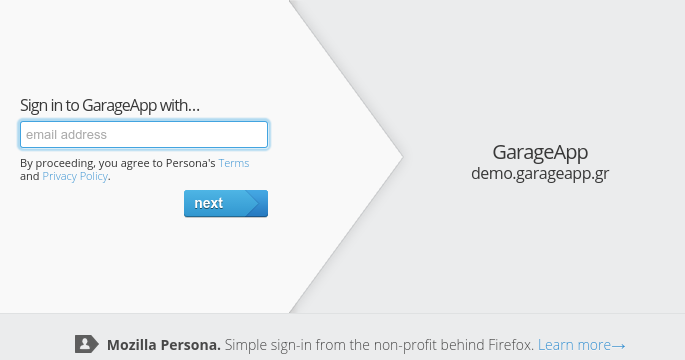
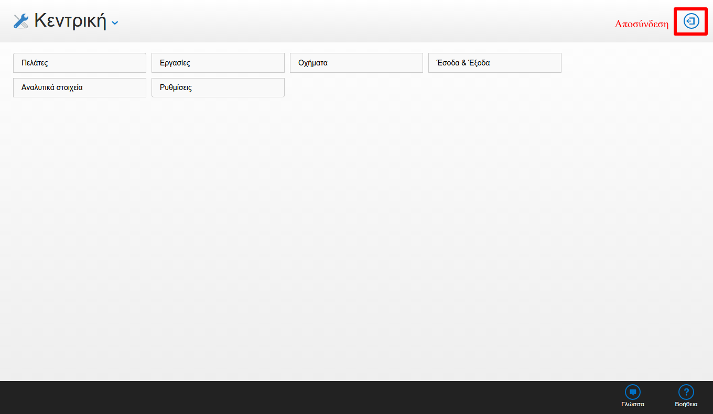
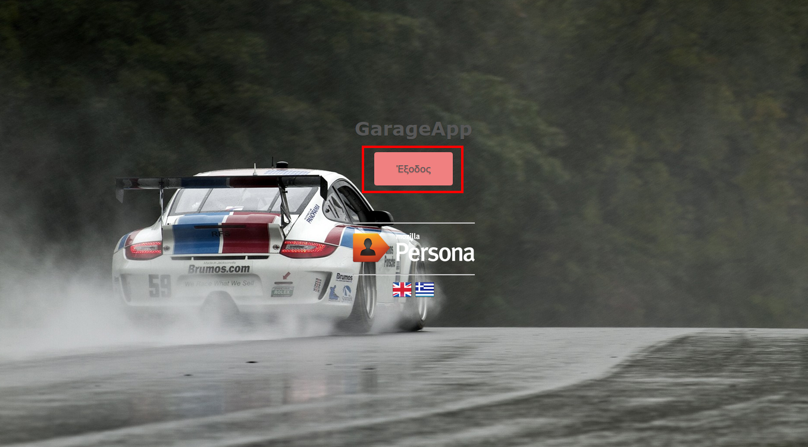

Είσοδος-Έξοδος
==============

Είσοδος στην εφαρμογή
---------------------

``#kb_Login``

Για να συνδεθείτε (login) στην εφαρμογή θα πρέπει πρώτα να πιστοποιήσετε τα στοιχεία σας.
Πιστοποίηση στοιχείων σημαίνει μόνο πιστοποίηση του email σας,
η οποία πιστοποίηση πραγματοποιείται από την υπηρεσία `Mozilla Persona <https://login.persona.org/about>`_ με τρόπο απλό και ασφαλή.

Έξοδος από την εφαρμογή
-----------------------

``#kb_Logout``

Η αποσύνδεση (logout) από την εφαρμογή γίνεται σε 2 σύντομα βήματα.

- Πατάμε "Αποσύνδεση" στη κεντρική οθόνη

- Και τέλος πατάμε "Έξοδος"

